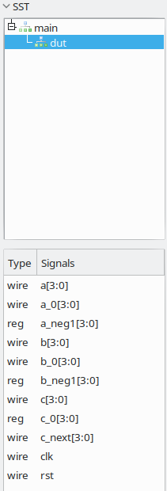

# Ripstop simulation

Ripstop exposes a Python library for using iverilog to simulate Ripstop code.

## Setup

You will need a Python greater than 3.7 to follow these steps.

To quickly set it up, create a Python virtual environment and use maturin to build and install the Python library:
```
$ python3 -m venv venv
$ . venv/bin/activate
$ pip install maturin
$ maturin develop
```

## Example Usage

Create a Ripstop file `adder.rp` with these contents:
```
module adder(bits<4> a, bits<4> b) -> (bits<4> c) {
    c[t] = a[t-1] + b[t-1];
}
```
This is a simple registered adder, with behaviour like:
```wavedrom
{signal: [
  {name: 'clk', wave: 'p.....'},
  {name: 'rst', wave: '10....'},
  {name: 'a', wave: '234567', data: [1, 2, 3, 4, 5, 6]},
  {name: 'b', wave: '234567', data: [2, 4, 6, 8, 10, 12]},
  {name: 'c', wave: 'xx3456', data: [6, 9, 12, 15]},
]}
```
Let's see it in action. First, create a Python file, `adder.py`, with these contents:
```
import base64
import sys
import time
from ripstop_lib import SimulationInstance

class Adder:
    def __enter__(self):
        self.instance = SimulationInstance("examples/adder.rp", "adder")
        self.instance.__enter__()
        return self

    def __exit__(self, *args):
        self.instance.__exit__()

    def reset_step(self, args):
        return self.instance.reset_step(args)

    def step(self, args):
        return self.instance.step(args)

with Adder() as decoder:
    decoder.reset_step({"a": 0, "b": 0})
    decoder.step({"a": 2, "b": 4})
    decoder.step({"a": 3, "b": 6})
    decoder.step({"a": 4, "b": 8})
    decoder.step({"a": 5, "b": 10})
    print(decoder.step({"a": 6, "b": 12}))
```
We'll go through this line-by-line in a moment. But first, let's run it:
```
$ python adder.py
```
If you get an error like:
```
thread '<unnamed>' panicked at 'called `Result::unwrap()` on an `Err` value: Os { code: 2, kind: NotFound, message: "No such file or directory" }', src/simulation.rs:25:57
```
then you probably are not running from the root of the `ripstop` repository. Which you need to do.

If it works, you will see a veritable torrent of output, followed by:
```
{'c': 15}
```
which is the output of the adder. Success!

Additionally, the simulation will create a `dump.vcd` file, which you can examine with (for example) GTKWave.

If you open the VCD file, you will see the following variables under the `dut`:


You can see all the input and output signals (`a`, `b`, `c`, `rst`, `clk`). Additionally, you can see variables like `a_0` - Ripstop creates variables to represent different time slices. For example, `c_next` is the value of `c` on the next cycle.

Select some variables to show them on screen:


Here, one thing pops out at us immediately, which is that the Python simulation updates input variables on the falling edge of the clock, so they appear a half-cycle delayed. Just something to watch out for.

But, there you have it, your first simulated Ripstop module!
